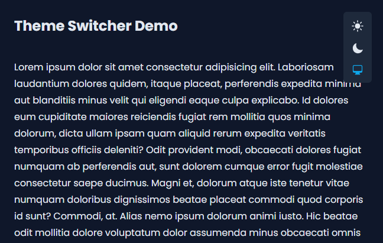

# Theme Switcher with React, Tailwindcss, & Vite

{ style="display: block; margin: 0 auto"; }

This feature is a simple starter template for changing color themes such as light mode, dark mode, or the system default theme.

Today's modern web or applications have several color theme choices on the page display, this makes the user experience better in comfortably viewing the content on the web or application.

In this starter template there are three color schemes such as light, dark, and system.

## Installation

1. Clone from this Repo:
   ```
   git clone https://github.com/rizqisetiaji7/theme-switcher-react.git
   ```
2. Open a terminal or command prompt, and install the dependencies:
   ```
   cd theme-switcher-react
   npm install
   ```
3. In the terminal or command prompt, start the local server
   ```
   npm run dev
   ```

Access via browser, and runs at the address `http://localhost:5173`